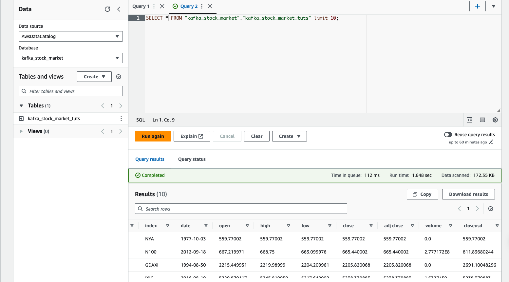

# Stock Market Kafka Real Time Data Engineering Project

## Introduction 
This project builds and execute an End-To-End Data Engineering Project on Real-Time Stock Market Data using Kafka. Here we use different technologies such as Python, Amazon Web Services (AWS), Apache Kafka, Glue, Athena, and SQL.

To goal of this project is to load data from a CSV file in real time (simulating real time stock market ingestion) and store it in Athena.

## Steps 
- Install necessary libraries
- Create topic
- Create a python kafka producer 
- Create a python kafka consumer 
- Load and read each row from the CSV every 1 second
- Store each row to s3 as a json file
- Load in Athena

## Architecture 

## Technology Used
- Programming Language - Python
- Amazon Web Service (AWS)
  - S3 (Simple Storage Service): A scalable object storage service used for storing and retrieving large amounts of data.
  - Athena: An interactive query service that allows you to analyze data in Amazon S3 using standard SQL
  - Glue Crawler: A service that automatically discovers and catalogs data in Amazon S3 to make it searchable in the AWS Glue Data Catalog.
  - Glue Catalog: A centralized metadata repository for storing table definitions and other schema-related information used by various AWS services.
  - EC2: A web service that provides secure, resizable compute capacity in the cloud.
- Apache Kafka: A distributed streaming platform used for building real-time data pipelines and streaming applications.

# Getting Started

To get started with the project:

1. **Set up Kafka**: Follow the steps documented in kafka_command.txt

2. **Create S3 bucket**
   
3. **Setup Glue Crawler**
   
4. **Create Glue Data Catalog**: Build a catalog from the crawled data
   
5. **Connect to AWS Athena**: Make queries with Athena
   
   
   